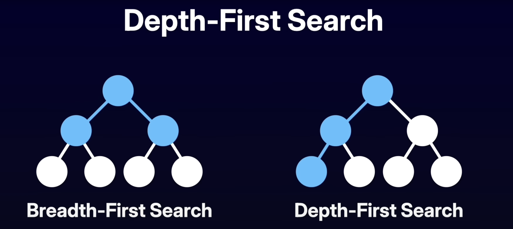

# Algorithms and Data Structures

Based on: https://www.youtube.com/watch?v=8hly31xKli0&t

## 1. Intro

- Algorithm: Set of steps/instructions for completing a task

  - Set of steps a program takes to finish a task

### Why learn algorithms?

1. When we talk about algorithms, we mean that there's a body of knowledge on how to solve some computational problems well
2. Understanding when to apply algorithms is as important as knowing their existence

- The most important part of DSA
- We should be able to break a problem down and identify which DSA are best placed for it
- Algorithm thinking
  - Break a complex problem into a smaller unit and be able to compose a solution to this smaller problem

3. Understanding efficiency/computational demand, both in time and space

### What is an algorithm?

1. Clearly defined problem statement, input and output
2. Steps order matter
3. Steps distinction matter
4. Must produce a result
   - Consistent results for the same of values is how we know the algorithm is correct
5. Must complete in a finite amount of time

### Algorithmic Thinking

- Clearly define what the problem set is
- Clarify what values count as inputs
- There's not a "best" solution, instead we should think what solution works better for the current problem
- Searching

  - Linear/sequential:

    1. Start at beginning
    2. Compare current value with target
    3. Move sequentially
    4. If current value is equal to target, return
    5. If end of the list and no value found, return
    6. Repeat steps 2-4 until done

  - Binary:

  1. Start at middle
  2. Compare current value with target
  3. If current value is greater than target, only focus on the left side
  4. If current value is less than target, only focus on the right side

- An algorithm needs to have a clear problem statement

  - We need to identify the inputs and define output

- Break down the problem into smaller units

### Good algorithm (Correctness & Efficiency)

1. Correctness: Capacity of algorithm of given valid inputs, terminate and produce expected output as defined in problem specification

   - Given valid inputs, it must provide expected output

2. Efficiency: Characteristic of algorithm to perform steps in an optmized manner, both in memory and computational operations
   - Time: how long it takes the algo to run
     - The less time you take, the more efficiency you are
   - Space: how much memory the algo needs

## Important Problem-Solving Patterns

1. Linear: Arrays, Linked Lists, Strings

- All linear algos are built on top of two pointers
- Two pointers, sliding windows, binary search

2. Non-linear: Trees, Graphs

- Tree: graph (no cycles)
- Graph (with cycles)
  - we need to keep track of visited

### 1. Two pointers

- Reduces the complexity of traversing linear structures. From quadratic to linear
- Same direction
  - Processing, scaning the data in a single pass
    - Fast and slow pointers
      - Cycle detection
- Opposite direction
  - Finding pairs
  - Comparing elements from opposite ends
    - Finding two numbers in a sorted array that sum up to target

https://algo.monster/templates/two-pointers-opposite

#### Two pointers (opposite directions)

```js
function twoPointers(nums) {
  let left = 0;
  let right = nums.length - 1;

  while (left < right) {
    // process current elements
    let current = process(arr[left], arr[right]);

    // update points on condition
    if (condition(arr[left], arr[right])) {
      left++;
    } else {
      right++;
    }
  }
}
```

#### Two pointers (same direction)

```js
function twoPointers(nums) {
  let slow = 0;
  let fast = 0;

  while (fast < nums.length) {
    // process current elements
    let current = process(arr[slow], arr[fast]);

    // update pointers based on condition
    if (condition(arr[slow], arr[fast])) {
      slow++;
    }

    // fast always moves forward
    fast++;
  }
}
```

### 2. Sliding window

- Extension of two pointers
- Window of elements
- Manages a subset of elements
- Powerful to track contiguous sequences

```js
function slidingWindow(nums, k) {
  let left = 0;
  let windowSum = 0;
  let result = 0; // or [], depending on problem

  for (let right = 0; right < nums.length; right++) {
    // expand window by including nums[right]
    windowSum += nums[right];

    while (conditionToShrink(nums, left, right, k)) {
      windowSum -= nums[left];
      left++;
    }

    result = process(windowSum, left, right, result);
  }

  return result;
}
```

### 3. Binary search

- Finding a target value in a sorted array
- It's in a way an expansion of the two pointers
  - left
  - right
  - middle
- It can be used in any list that has a `monotonic function`
  - any condition that can be used for sorting
    - find minimum in rotated sorted array

```js
function binarySearch(nums, target) {
  let left = 0;
  let right = nums.length - 1;

  while (left <= right) {
    const mid = Math.floor((left + right) / 2);

    if (nums[mid] === target) {
      return mid;
    }

    if (nums[mid] < target) {
      left = mid + 1; // search right half
    } else {
      right = mid - 1; // search left half
    }
  }

  return -1;
}
```

### 4. Breadth-First Search (Uses a Queue)

- Starts at the root and visits all the nodes within a given level
- Visits the neighbors before visiting the children
- Uses a queue

```
             root

  child  child      child   child ____ level 1 => BFS will visit all here

leaf  leaf  leaf   leaf  leaf  leaf ___level 2 => then all here
```

```js
function bfs(start, graph) {
  const queue = [start];
  const visited = new Set([start]);

  while (queue.length) {
    const node = queue.shift(); // dequeue
    process(node); // custom logic

    for (const neighbor of graph[node]) {
      if (!visited.has(neighbor)) {
        visited.add(neighbor);
        queue.push(neighbor);
      }
    }
  }
}
```

```js
/* 
Binary Tree Level order traversal

Given the root of a binary tree, return the level order traversal of its nodes' values (i.e, from left to right, level by level)

       3 
    9    20
        15  7
        root  level1 level 2
result [[3],[9,20],[15,7]]
          from left to right
*/

function levelOrderTraversal(root) {
  if (!root) {
    return [];
  }

  const result = [];
  const queue = [root];

  while (queue.length) {
    const levelSize = queue.length;
    const level = [];

    for (let i = 0; i < levelSize; i++) {
      const node = queue.shift();
      level.push(node.val);

      if (node.left) {
        queue.push(node.left);
      }

      if (node.right) {
        queue.push(node.right);
      }
    }

    result.push(level);
  }

  return result;
}
```

### 5. Depth-First Search (Uses a Stack)

- Dives deep on a path as far as possible, before visiting the neighbors
- It visits the children, before visiting the neighbors



| BFS                    | DFS                          |
| ---------------------- | ---------------------------- |
| Queue                  | Stack                        |
| Iterative              | Recursive                    |
| Best for shortest path | Best for exploring all paths |

```js
function dfsTree(root, target) {
  if (!root) {
    return null;
  }

  if (root.val === target) {
    return root;
  }

  const left = dfsTree(root.left, target);

  if (left) {
    return left;
  }

  return dfsTree(root.right, target);
}

function dfsGraph(node, graph, visited = new Set()) {
  for (const neighbor of graphs[node]) {
    if (visited.has(neighbor)) {
      continue;
    }

    visited.add(neighbor);

    dfsGraph(neighbor, graph, visited);
  }
}
```

### 6. Backtracking

- Similar to dfs
- Differently from dfs, which has a pre-built structure, on Backtracking, you need to build it yourself
  - The structure of the tree isn't given, but it's generated dynamically as you make decisions
  - When a decision leads to a dead-end, you backtrack to the previous decision

```js
function backtrack(path, options) {
  if (isComplete(path)) {
    results.push([...path]); // store valid solution
    return;
  }

  for (const option of options) {
    if (!isValid(path, option)) {
      continue;
    }

    path.push(option); // choose
    backtrack(path, nextOptions(option)); // explore
    path.pop();
  }
}
```

### 7. Heap

- Priority Queue (Top K)
- Most common implementation of priority queues is a heap

#### Min Heap

- Used to find the K largest

```
      2
  7       4
9   13  5   76
```

#### Max Heap

- Used to find the K smallest

```
      20
  15      6
9   8   4   2
```

### 8. Dynamic programming

- Considered the hardest pattern to learn
- Top-down: backtracking + memoization
- Bottom-up

## More advanced patterns

9. Divide and conquer
10. Trie
11. Union Find
12. Greedy
